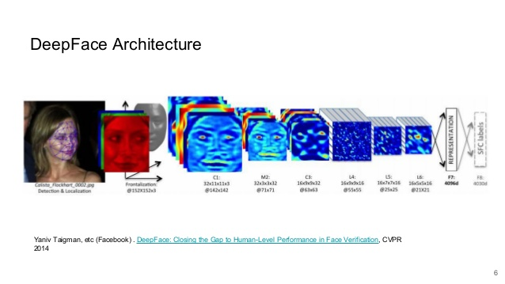

# video-recognition
ML models for facial recognition, object detection and recognition and emotion detection. 

In this repository, we are going to demonstrate some computer vision application of deep learning models. We will show how, these models can do Facial recognition, Object detection and Emotion detection. Yes, all of these tasks in real-time. But, let's first see what happens under the hood in these kind of systems. 

### Facial Recognition 
For facial recognition, we have lots of different models out there which can do great job on generating face embedding for faces. Let's see how the whole system will work, 
 

 1. The model is trained to generate face embedding vector for faces it feed during training. Now, we have a model which can generate face embedding vector if we feed face image to it. In above picture you can see Deep-Face model which can do this for us. 
 2. Now, we generate face embeddings of user and put them with the name in database of our system. 
 3. Whenever there is some unknown user in front of our camera, the model will generate face embedding for that unknown face. 
 4. This unknown face embedding will be compraed with the embedding in database and using euclidean distance, we will measure whether the faces are same or not. 
 5. If face is similar to someone from the database, then label the unknown face with the name of the user. 

This is just a simple overview of what happens under the hood. There few more things that the systems like FaceLock of Iphone uses like detecting whether the image fed is real human or just a fake one. Yeah, that is why it is next to impossible to fool the facelock system. 