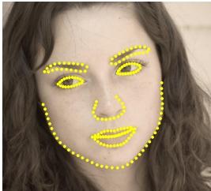

# video-recognition
ML models for facial recognition, object detection and recognition and emotion detection. 

In this repository, we are going to demonstrate some computer vision application of deep learning models. We will show how, these models can do Facial recognition, Object detection and Emotion detection. Yes, all of these tasks in real-time. But, let's first see what happens under the hood in these kind of systems. 

## Facial Recognition 
For facial recognition, we have lots of different models out there which can do great job on generating face embedding for faces. Let's see how the whole system will work, 
 

 1. The model is trained to generate face embedding vector for faces it feed during training. Now, we have a model which can generate face embedding vector if we feed face image to it. In above picture you can see Deep-Face model which can do this for us. 
 2. Now, we generate face embeddings of user and put them with the name in database of our system. 
 3. Whenever there is some unknown user in front of our camera, the model will generate face embedding for that unknown face. 
 4. This unknown face embedding will be compraed with the embedding in database and using euclidean distance, we will measure whether the faces are same or not. 
 5. If face is similar to someone from the database, then label the unknown face with the name of the user. 

This is just a simple overview of what happens under the hood. There are few more things that the systems like FaceLock of Iphone uses like detecting whether the image fed is real human or just a fake one. Yeah, that is why it is next to impossible to fool the facelock system. 

 * Usecase 
  1. Facelock for phones. Iphone has this feature.
  2. Facial recognition security systems. Just like BAIDU uses for entering into their HQ.
  3. surveillance systems. Government can use for protecting people and suspecting terrorist in public. 

## Emotion Detection 
For emotion detection, we can use the same idea that we saw in face recognition. The only change is that instead of generating face embedding vector, we will generate facial landmarks, or key-points for face and then compute the distance between those points to find out the exact emotion of person. Below is the picture of woman with 68 landmarks detected on her face.
 

Once we got the distnaces corresponding to each emotion,we can train a deep learning model to find out the emotion based on the distance. The key steps will be 
 1. Create dataset with landmarks distance and respective emotion. 
 2. Train deep learning model on this data. 
 3. Use face image as input and find out the landmarks, then calculate the distance and feed that into deep learning model to get the final output of emotion label. 

 * Usecae
  1. Customer behaviour analysis.
  2. Public behaviour analysis.
  3. Patient analysis in mental hospitals. 
  4. In office work mood analysis of employees. 

## Object Detection 
Object detection is one of the hardest thing in computer vision, which is now easy to do, thanks to deep learning. Models like YOLO and SSDLite are so fast that object detection can be done in real time without any kind of problem. Below is the image from official YOLO paper on how it works. 
 

 YOLO uses a grid to divide the whole image into some smaller patches. Then it tries to predict whether there is object or not and which objevct it is. Once we got lots of anchor boxes, using non-max suppression we neglect the boxes which has low probability of having any meaningful objects. The above image demonstrate that scenario quite well. 

 There are other models like R-CNN, Fast-RCNN and different variants of it, but they are not quite fast and can not be used in real-time detection. 

  * Usecase
   1. Harmful object detection in public.
   2. Weapon detection in prison. 
   3. Customer behaviour analysis. 

 